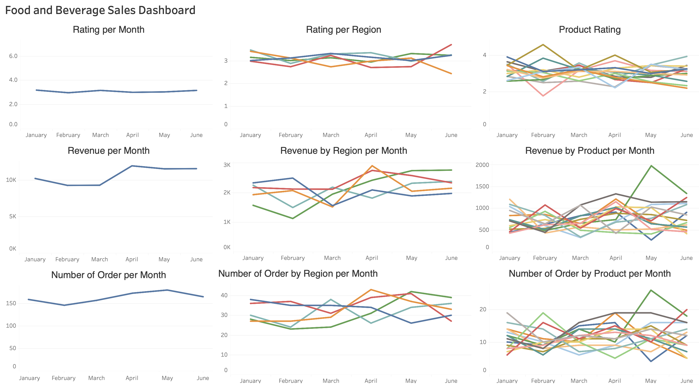

# Food and Beverage Business Analysis

### Dataset Explanation
- `order_id` : Synthetic order identifier. This value is intentionally not unique, allowing multiple products to belong to the same order (bridge table / order-item structure).
- `product_name` : Generic fictional food or beverage product name.
- `order_date` : Date and time when the order was placed.
- `order_type` : Order fulfillment method (Takeaway, Dine-In, or Online).
- `payment_method` : Payment method used for the transaction.
- `rating` : Customer rating for the ordered product (1–5).
- `price` : Selling price per unit of the product.
- `region` : Fictional business region where the order originated.
- `preparation_time_minutes` : Time taken to prepare the product, in minutes.
- `quantity` : Number of units ordered for the product.
- `line_total` : Total amount for the order line (price × quantity).
- `employee_id` : Synthetic identifier for the employee who prepared or handled the order.

## Metrics

The dashboard and analysis focusing on Head Of Product and Head of Sales to examine their FnB Business overtime.

- Waiting time
- Rating
- Order
- Revenue

[See the dashboard](https://public.tableau.com/views/fnb_dashboard/Dashboard22?:language=en-GB&:sid=&:redirect=auth&:display_count=n&:origin=viz_share_link)

---

## Insights

### Preparation Time
- All of our restaurant have a similar average preparation time, ranging from 23 to 24 minutes.
- At West restaurant, burgers (dine-in and online) and fries (pickup) take the longest time to prepare on average.
- At East restaurant, Cake (takeaway), sandwich (takeaway) and Burger (online) take the longest time to prepare on average.
- At North restaurant, Wrap (Online), Rice Bowl (Online) and Salad (Dine-in) take the longest time to prepare on average.
- At South restaurant, Pasta (Dine-in), Latte (Online) and Smoothie (Online) take the longest time to prepare on average.
- Lastly, at our South restaurant, Pizza (Online), Smoothie (Online) and Burger (Dine-in) take the longest time to prepare on average.

### Rating
- According to the analysis, we understand that second, fourth, fifth months have the lowest rating in this datasets, ranging from 2.9 - 3
- On the second month our restaurant in north, south, and west region have the lowest rating. It range around 2 - 3
- on forth month our restaurant in north, west, east region have the lowest rating. It range around 2.6 - 2.9
- on fifth month our restaurant in north, south, and central region have the lowest rating. They range around 2.7 - 3

  
- Overall, our restaurant in east, north, and west have the lowest rating from 5 of our restaurant. their rating raging from 2.9 - 3.1
- if we focus on our restaurant in east, the lowest rating come from their fries, followed by latte and coffe.
- And for the second lowest rating is our restaurant in North, the lowest rating come from our Pizza, followed by latte and smoothie.
- And for the last lowest rating, is our restaurant in West, the lowest rating come from our Noodle, followed by Coffe and Rice Bowl.

### Order Type
- Customers in the North region prefer to dine in at our store.
- Customers in the West and South regions prefer to place online orders.
- For takeaway orders, customers prefer the South restaurant.

### Payment Method
- Based on the data, customers at the Central restaurant prefer to pay for their food using e-wallets (72 orders). However, at our other restaurants (East, North, South, and West), customers prefer to pay with cash (around 74 - 76 orders).

### Revenue
- According to the data, the restaurant generated the highest revenue in April (11k), June(11k), and May(11k), while the lowest revenue was recorded in March (9k).

### Number of Order
- According to the data, May and April had the highest number of orders compared to the other months, with 180 and 173 orders, respectively.
- According to the data, on May latte (dine-in and online) has the highest order number (11 order) followed by tea (dine in) with 8 order in that period
- According to the data, on april coffee (dine-in) is the number one item that get ordered (8 order), followed by tea through online order (8 order), and burger (online) with 7 order during that month--April
- the top-selling items at our Central restaurant are wraps, rice bowls, and coffee.
- the top-selling items at our East restaurant are Latte, Pizza, and Smoothie.
- the top-selling items at our South restaurant are Latte, Tea, and Salad.
- the top-selling items at our East restaurant are Latte, Sandwich, and Fries.
- the top-selling items at our North restaurant are tea, cake, smoothie.
---
## Recomendations
### Preparation Time
- Every regional manager should conduct a profound evaluation of the preparation process. Understand the disadvantages or problems at each stage, then arrange a meeting with the chefs and the Head of Operations to discuss the insights and identify ways to improve the preparation time.

### Rating
- Examine reataurant performance during well-performing month (sold-out items, available items, marketing campaigns, discounts, customer behavior (holiday season or not)) then compare the insight to the month that have bad rating. If there’s any implementable insight, copy the approach on well rating month to the bad rating month
- Conduct extensive analysis to our south and central restaurant, analyze the high-demand item in that restaurant, what dish or beverage that available, understand the marketing campaign, and perfom survery or ask customer opinion who have came to the restaurant. From the finding, try to find the transferable insight to low rating restaurant and we can add a training session from high rating restaurant to low rating restaurant

### Order Type
- Understanding the reason why certain order type do not perform well on every area. Conduct a meeting with regional manager and operational team to improve any problem founded on order type that do no not performing well
- Running marketing campaign, bundle, or discount for the order type that not really popular in that area. 

### Number of Order
- Conduct a survey, to find the reason why certain prodcut perform better than other product. If implementable, implement the insight to not performing product
- Make a bundle item between low-demand product with highe-demand product to boost and introcduce low-demand product to new customer
- Running a marketing campaign and discount for not performing product to attract new customer to try the not-well-known product

### Payment Method
- Analyze each order payment method, make sure highly use payment method available on every store
Conduct a survey or interview to our customer, on why use certain payment method, from there we can either eliminate or keep certain payment method
- Conduct an agreement with payment provider to make marketing campaign or discount to introduce and attarct new user

### Revenue
- understand why the revenue fell or different from other well-performing months. Analyze the item, order, and marketing during those months. Replicate or adjust the well running region insight to not well perform region

---
## Acknowledgements

- **Data:** Personal Knowledge and ChatGPT
- **Tools Used:** Jupyter Notebook, SQLite, Tableau

